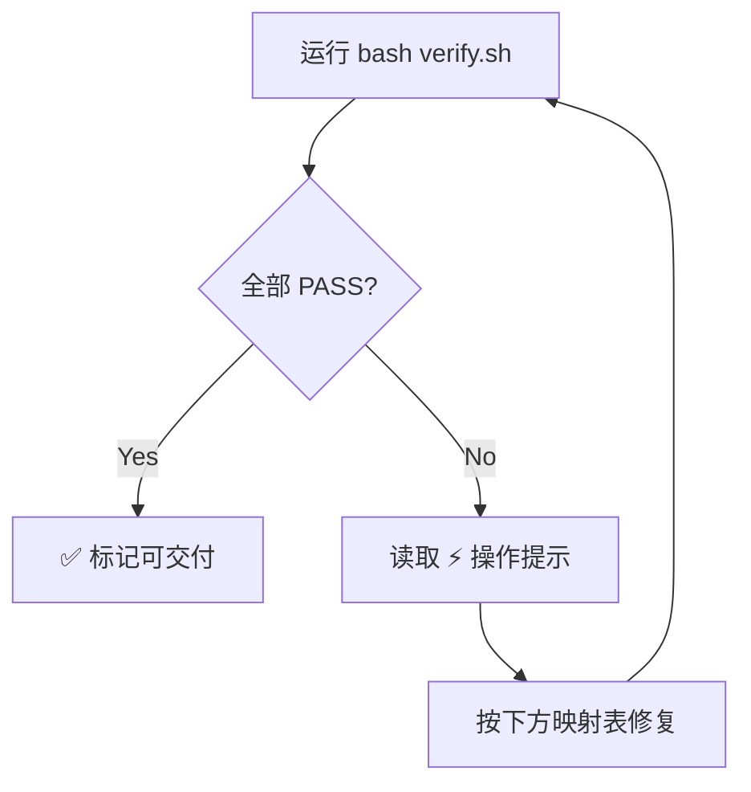

# AI Agent 自动修复工作流

> detect → fix → re-verify → 循环直到全部 PASS

## 标准流程



## 失败项 → Agent 动作映射表

### 1. `cargo check` 失败

| 错误类型 | 检测方式 | Agent 动作 |
|---------|---------|-----------|
| 编译错误 | 查看 `cargo check` 输出中的 `error[E...]` | 按编译器提示逐行修复 |
| 警告 | 查看 `warning:` 输出 | 修复 `unused` / `dead_code` / 未使用的导入 |

**典型修复模式**:
```bash
# 运行 cargo check 获取错误详情
cargo check 2>&1

# 逐错误修复
# 1. 修复声明/导入
# 2. 添加缺失的类型或方法
# 3. 再次验证
cargo check 2>&1
```

### 2. 硬编码魔数

```
detect: verify.sh 输出 [FIX] 发现以下硬编码值
       src/map/mode7.rs:15:  let horizon_y = 192.0;
```

**修复模式**:
1. 检查 `constants.rs` 是否有合适的常量
2. 若有: 用常量名替换硬编码值，`use golden_sun::constants::HORIZON_Y`
3. 若无: 在 `constants.rs` 新增常量，注释用途 + 所属 Phase
4. 验证: `cargo check`

### 3. `unwrap()` 裸调用

```
detect: verify.sh 输出 [FIX] 发现以下 unwrap() 调用
       src/map/tilemap.rs:22:  let tile = TILE_PALETTE.get(i).unwrap();
```

**修复模式**:
```rust
// 方案 A (推荐): 返回 GameResult
let tile = TILE_PALETTE.get(i)
    .ok_or(GameError::MapParseError(format!("无效 tile 索引 {i}")))?;

// 方案 B (函数内可处理): 带默认值
let tile = TILE_PALETTE.get(i).copied().unwrap_or(TileKind::Unknown);

// 方案 C (test 内): 用 assert!(...) 或 #[allow(clippy::unwrap_used)]
```

### 4. 测试失败

```
detect: verify.sh 输出 [FAIL] 测试未通过
       tests/tilekind_bdd.rs:12: tilekind_encode_decode_forest ... FAILED
       assertion `left == right` failed: left: Forest, right: Grass
```

**修复模式**:
1. 读测试代码 → 理解预期行为
2. 读 feature 文件 → 确认规格
3. 修复实现代码 → 而非修改测试
4. 重新运行: `cargo test <test_name>` → 单项验证
5. 全量: `cargo test`

### 5. 架构文件缺失

```
detect: verify.sh 输出 [FAIL] 缺少架构文件: src/engine/xxx.rs 不存在
```

**修复模式**:
```rust
// 创建骨架文件:
//! xxx 模块
//!
//! ⏳ Phase N 实现

// 在 lib.rs 中补充:
pub mod xxx;
```

### 6. Release 构建失败

```
detect: verify.sh 输出 [FAIL] release 构建失败
```

**修复模式**:
1. 运行 `cargo build --release 2>&1` 读取完整错误
2. debug 和 release 差异通常在：溢出检查、链接时间优化、增量编译
3. 排查未初始化变量、整数溢出、循环终结性
4. 可以在 debug 配置中加 `overflow-checks = true` 先暴露问题

## 关键原则

1. **不要修测试来通过测试**——测试是规格文件（`.feature`）翻译过来的，修实现代码
2. **修一项 → 立刻 re-run verify.sh**——减少人工判断"还有哪些没修"
3. **无法修复的 FAIL 项**——标注原因（如"需要外部资源"、"依赖未完成 Phase"），作为已知问题记入 tasks.md 备注
4. **收敛检查**——连续 3 次验证该 FAIL 项无变化，停止自动修复，报告给用户决策
